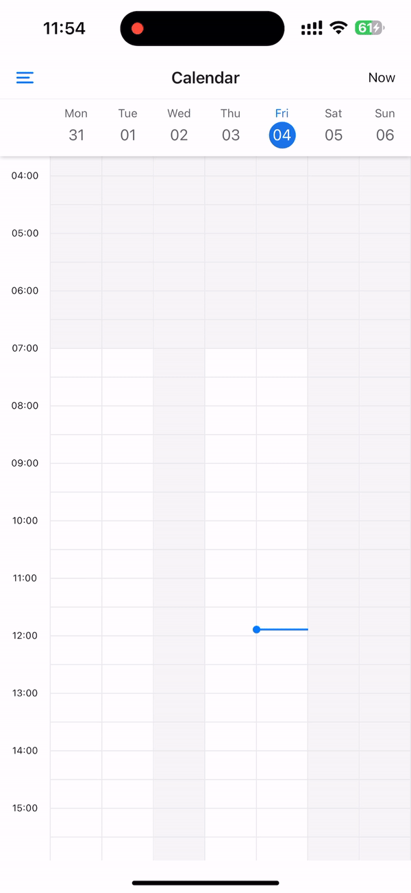

# 📅 React Native Calendar Kit

React Native Calendar component, fully implemented using @shopify/flash-list, react-native-gesture-handler and react-native-reanimated. Support pinch to zoom, drag and drop to create/update event.

[![Version][npm-shield]][npm-link]
[![PayPal_Me][paypal-me-shield]][paypal-me]
[![ko-fi][ko-fi-shield]][ko-fi-profile]

[](https://user-images.githubusercontent.com/33460888/199891737-af6957ba-6a2c-49ee-8312-6feca89a2c39.MP4)

## Installation

Using Yarn:

```
$ yarn add @howljs/calendar-kit
```

Using NPM:

```
$ npm install --save @howljs/calendar-kit
```

The libraries we will install now are [@shopify/flash-list](https://shopify.github.io/flash-list/), [react-native-gesture-handler](https://docs.swmansion.com/react-native-gesture-handler/) and [react-native-reanimated](https://docs.swmansion.com/react-native-reanimated/). If you already have these libraries installed and at the latest version, you are done here! Otherwise, read on.

## Installing dependencies into a bare React Native project

Using Yarn:

```
$ yarn add @shopify/flash-list react-native-gesture-handler react-native-reanimated
```

Using NPM:

```
$ npm install --save @shopify/flash-list react-native-gesture-handler react-native-reanimated
```

> Follow installation instructions for [React Native Reanimated](https://docs.swmansion.com/react-native-reanimated/docs/fundamentals/installation) and [React Native Gesture Handler](https://docs.swmansion.com/react-native-gesture-handler/docs/installation).

## Installing dependencies into an Expo managed project

```
$ npx expo install @shopify/flash-list react-native-gesture-handler react-native-reanimated
```

> Follow installation instructions for [React Native Reanimated](https://docs.expo.dev/versions/latest/sdk/reanimated/) and [React Native Gesture Handler](https://docs.expo.dev/versions/latest/sdk/gesture-handler/).

## Documentation

- [Guides](https://howljs.github.io/react-native-calendar-kit/docs/intro)

- [Example](./example/)

## Features

- [Pinch to zoom](https://howljs.github.io/react-native-calendar-kit/docs/guides/pinch-to-zoom)
- [Drag and drop to create a new event](https://howljs.github.io/react-native-calendar-kit/docs/guides/drag-to-create)
- [Drag and drop to edit the event](https://howljs.github.io/react-native-calendar-kit/docs/guides/drag-to-edit)
- [Set unavailable hours and unavailable days](https://howljs.github.io/react-native-calendar-kit/docs/guides/unavailable-time)

## Basic Usage

```tsx
import { TimelineCalendar } from '@howljs/calendar-kit';

// Week View
<TimelineCalendar viewMode="week" />;

// Day View
<TimelineCalendar viewMode="day" />;

// 3-days
<TimelineCalendar viewMode="threeDays" />;

// Work week
<TimelineCalendar viewMode="workWeek" />;
```


[npm-shield]: https://img.shields.io/npm/v/@howljs/calendar-kit
[ko-fi-shield]: https://img.shields.io/static/v1.svg?label=%20&message=ko-fi&logo=ko-fi&color=13C3FF
[paypal-me-shield]: https://img.shields.io/static/v1.svg?label=%20&message=PayPal.Me&logo=paypal
[paypal-me]: https://www.paypal.me/j2teamlh
[ko-fi-profile]: https://ko-fi.com/W7W6G75FH
[npm-link]: https://www.npmjs.com/package/@howljs/calendar-kit