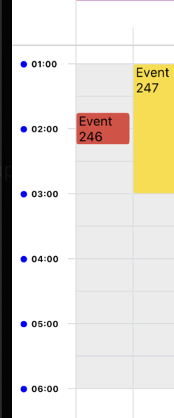

# CalendarBody

`CalendarBody` is a core component of the React Native Calendar Kit. It renders the main calendar grid, including time slots, events, and various interactive elements.

## renderHour

A function that allows customization of the hour labels in the time column of the calendar.

### Description

The `renderHour` prop provides a way to customize the appearance of hour labels in the calendar's time column. When provided, this function will be called for each hour label, allowing you to render custom content instead of the default hour text.

### Parameters

The function receives an object with the following properties:

- `hourStr`: A string representation of the hour (e.g., "9:00 AM").
- `minutes`: The number of minutes since the start of the day for this hour label.
- `style`: The default style object applied to the hour label. You can extend or override this style in your custom rendering.

### Return Value

The function should return a React node (e.g., JSX element) that will be rendered as the hour label.

### Example

Here's an example of how to use the `renderHour` prop to create custom hour labels with a colored dot:

```tsx
const renderHour = useCallback(({ hourStr }: RenderHourProps) => {
    return (
      <View style={styles.hourContainer}>
        <View style={styles.dot} />
        <Text style={styles.hourText}>{hourStr}</Text>
      </View>
    );
  }, []);

 <CalendarBody renderHour={renderHour} />

const styles = StyleSheet.create({
  hourContainer: {
    flexDirection: 'row',
    alignItems: 'center',
    position: 'absolute',
    left: 8,
    right: 0,
    top: -4,
    gap: 4,
  },
  dot: {
    width: 6,
    height: 6,
    borderRadius: 3,
    backgroundColor: 'blue',
  },
  hourText: {
    fontWeight: 'bold',
    fontSize: 8,
  },
});
```

In this example, we're rendering a small blue dot next to each hour label and making the text bold. You can customize this further based on your specific design requirements.


