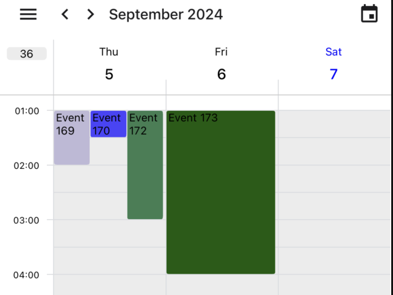
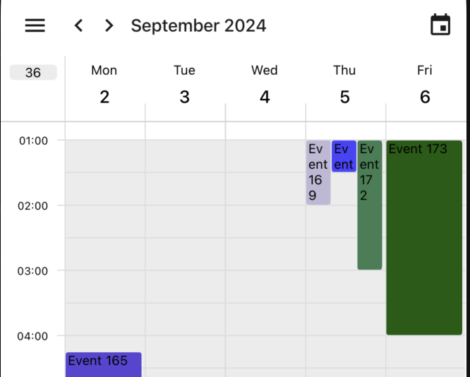

# View Mode

React Native Calendar Kit offers flexibility in customizing the calendar view mode. You can adjust the number of days displayed

## Adjusting Number of Days

You can set the number of days to display using the `numberOfDays` prop:

Default `numberOfDays` is `7`.

```tsx
<CalendarContainer numberOfDays={3}>
    <CalendarHeader />
    <CalendarBody />
</CalendarContainer>
```



The `numberOfDays` prop accepts values from 1 to 7. For example:
- `1`: Shows a single day view
- `3`: Shows a 3-day view
- `7`: Shows a full week view

## Controlling Navigation

Default behavior is to scroll by the number of days set in `numberOfDays`. You can change this behavior by setting `scrollByDay` to `true`:

```tsx
<CalendarContainer numberOfDays={3} scrollByDay={true}>
    <CalendarHeader />
    <CalendarBody />
</CalendarContainer>
```

- When `scrollByDay` is `true`, the calendar will scroll one day at a time.
- When `false`, it will scroll by the number of days set in `numberOfDays`.

## Showing/Hiding Weekdays

You can customize which weekdays are displayed in the calendar using the `hideWeekDays` prop:

```tsx
<CalendarContainer hideWeekDays={[6, 7]}>
    <CalendarHeader />
    <CalendarBody />
</CalendarContainer>
```



The `hideWeekDays` prop accepts an array of numbers representing the days of the week (1 for Monday, 7 for Sunday, etc.). Any day included in this array will be hidden from the calendar view.

> Note: When hiding weekdays, if `numberOfDays` is larger than the number of visible days, the calendar will automatically adjust `numberOfDays` to show the correct number of days.

## First Day of Week

You can set the first day of the week using the `firstDay` prop, where `1` is Monday and `7` is Sunday. Default is `1`

```tsx
<CalendarContainer firstDay={1}>
    <CalendarHeader />
    <CalendarBody />
</CalendarContainer>
```

## Minimum/Maximum and Initial Date

You can set the minimum and maximum date for the calendar using the `minDate` and `maxDate` props, and set the initial date using the `initialDate` prop:

- `minDate` and `maxDate` are used to set the range of dates that can be selected. Default `minDate` is 2 years ago and `maxDate` is 2 years from today.
- `initialDate` is used to set the initial date of the calendar. It must be within the range set by `minDate` and `maxDate`. Default is `today`.
> Default calendar will scroll to current date, so if you set `initialDate`, you need to set `scrollToNow={false}` to prevent it from scrolling to the current date.
> 
> `initialDate` only affects the initially displayed date, please use [goToDate](./methods#gotodate) method to change the date after the calendar is mounted.

```tsx
<CalendarContainer
    scrollToNow={false}
    minDate="2024-01-01"
    maxDate="2024-12-31"
    initialDate="2024-03-11">
    <CalendarHeader />
    <CalendarBody />
</CalendarContainer>
```
