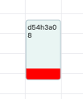

import ReactPlayer from 'react-player';
import dragToEdit from './img/drag-to-edit.mp4';
import dragToEditCustom from './img/drag-to-edit-custom.png';

# Drag to edit

When `selectedEvent` is declared, edit mode will be enabled

## Example

```jsx title="Example"
import { EventItem, PackedEvent, TimelineCalendar } from '@howljs/calendar-kit';
import React, { useState } from 'react';
import {
  SafeAreaView,
  StyleSheet,
  Text,
  TouchableOpacity,
  View,
} from 'react-native';

const exampleEvents: EventItem[] = [
  {
    id: '1',
    title: 'Event 1',
    start: '2022-11-06T09:00:05.313Z',
    end: '2022-11-06T12:00:05.313Z',
    color: '#A3C7D6',
  },
  {
    id: '2',
    title: 'Event 2',
    start: '2022-11-06T11:00:05.313Z',
    end: '2022-11-06T14:00:05.313Z',
    color: '#B1AFFF',
  },
];

const Calendar = () => {
  const [events, setEvents] = useState<EventItem[]>(exampleEvents);
  const [selectedEvent, setSelectedEvent] = useState<PackedEvent>();

  const _onLongPressEvent = (event: PackedEvent) => {
    setSelectedEvent(event);
  };

  const _onPressCancel = () => {
    setSelectedEvent(undefined);
  };

  const _onPressSubmit = () => {
    setEvents((prevEvents) =>
      prevEvents.map((ev) => {
        if (ev.id === selectedEvent?.id) {
          return { ...ev, ...selectedEvent };
        }
        return ev;
      })
    );
    setSelectedEvent(undefined);
  };

  const _renderEditFooter = () => {
    return (
      <View style={styles.footer}>
        <TouchableOpacity style={styles.button} onPress={_onPressCancel}>
          <Text style={styles.btnText}>Cancel</Text>
        </TouchableOpacity>
        <TouchableOpacity style={styles.button} onPress={_onPressSubmit}>
          <Text style={styles.btnText}>Save</Text>
        </TouchableOpacity>
      </View>
    );
  };

  return (
    <SafeAreaView style={styles.container}>
      <TimelineCalendar
        viewMode="week"
        events={events}
        onLongPressEvent={_onLongPressEvent}
        selectedEvent={selectedEvent}
        onEndDragSelectedEvent={setSelectedEvent}
        // Optional
        dragStep={20}
        theme={{
          dragHourContainer: {
            backgroundColor: '#FFF',
            borderColor: '#001253',
          },
          dragHourText: { color: '#001253' },
          editIndicatorColor: '#FFF',
        }}
        // End Optional

        // Custom edit indicator
        EditIndicatorComponent={<View style={{ backgroundColor: 'red', width: '100%', height: 16 }} />}
      />
      {!!selectedEvent && _renderEditFooter()}
    </SafeAreaView>
  );
};

export default Calendar;

const styles = StyleSheet.create({
  container: { flex: 1, backgroundColor: '#FFF' },
  footer: {
    position: 'absolute',
    bottom: 0,
    left: 0,
    right: 0,
    backgroundColor: '#FFF',
    height: 85,
    shadowColor: '#000',
    shadowOffset: {
      width: 0,
      height: -2,
    },
    shadowOpacity: 0.22,
    shadowRadius: 2.22,
    elevation: 3,
    flexDirection: 'row',
    justifyContent: 'center',
  },
  button: {
    height: 45,
    paddingHorizontal: 24,
    backgroundColor: '#1973E7',
    justifyContent: 'center',
    borderRadius: 24,
    marginHorizontal: 8,
    marginVertical: 8,
  },
  btnText: { fontSize: 16, color: '#FFF', fontWeight: 'bold' },
});

```

<ReactPlayer playing controls url={dragToEdit} />

## Props

### selectedEvent

When selectedEvent is declared, edit mode will be enabled

<span style={{ color: 'grey' }}>object</span>

### onLongPressEvent

Callback function will be called when the event item is long pressed

<span style={{ color: 'grey' }}>function</span>

### onEndDragSelectedEvent

Callback function will be called when the selected event item is dropped

<span style={{ color: 'grey' }}>function</span>

### dragStep

Handle the navigation time when navigating to next/previous view while dragging. Default is 10 minutes

<span style={{ color: 'grey' }}>number</span>

### theme


- `editIndicatorColor`

- `dragHourContainer`

- `dragHourText`

<span style={{ color: 'grey' }}>object</span>

### EditIndicatorComponent

Custom edit indicator



<span style={{ color: 'grey' }}>Component</span>
