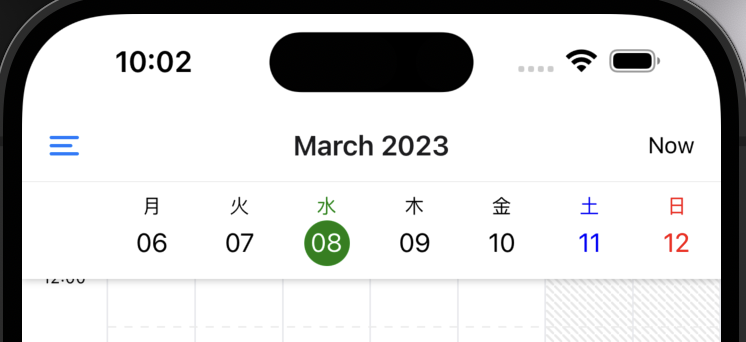

# Locale

The calendar can be localized by adding custom locales.

```jsx title="Example"
import React from 'react';
import { SafeAreaView, StyleSheet } from 'react-native';
import { MomentConfig } from '@howljs/calendar-kit';

MomentConfig.updateLocale('ja', {
  weekdaysShort: '日_月_火_水_木_金_土'.split('_'),
});

MomentConfig.updateLocale('vi', {
  weekdaysShort: 'CN_T2_T3_T4_T5_T6_T7'.split('_'),
});

const Calendar = () => {
  return (
    <SafeAreaView style={styles.container}>
      <TimelineCalendar
        viewMode="week"
        locale="ja" // Language settings will be displayed. Default is `en`
      />
    </SafeAreaView>
  );
};

export default Calendar;

const styles = StyleSheet.create({
  container: { flex: 1, backgroundColor: '#FFF' },
});
```


