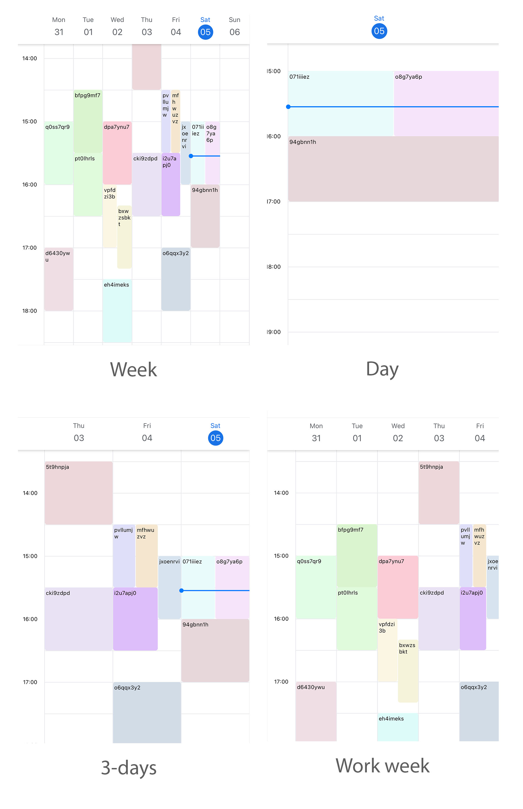

# View Mode
TimelineCalendar has 4 modes: **week**, **day**, **threeDays** and **workWeek**

```jsx title="Example"
import React from 'react';
import { SafeAreaView, StyleSheet } from 'react-native';
import { TimelineCalendar } from '@howljs/calendar-kit';

const Calendar = () => {
  return (
    <SafeAreaView style={styles.container}>
      <TimelineCalendar viewMode="week" />
    </SafeAreaView>
  );
};

export default Calendar;

const styles = StyleSheet.create({
  container: { flex: 1, backgroundColor: '#FFF' },
});
```


